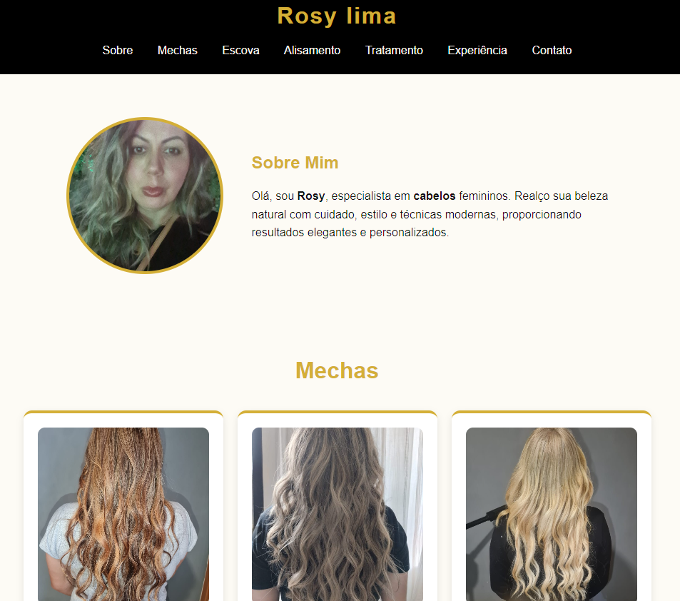

# Salon Virtual Rosy Lima

Projeto desenvolvido na faculdade com o objetivo de criar um site profissional para uma cabeleireira, fortalecendo sua presença digital e divulgando seus serviços de forma moderna e acessível.

## Preview do Projeto



## Funcionalidades

- Apresentação do salão e da profissional
- Exibição dos serviços oferecidos
- Layout responsivo para celular e computador
- Navegação simples e intuitiva

## Tecnologias Utilizadas

- HTML5
- CSS3
- Visual Studio Code

## 🔗 Acesse diretamente o site:

```

https://nataschafritzen.github.io/salon-virtual-rosy-lima/

```

## Como Executar

1. Clone este repositório para o seu ambiente local:

```

https://github.com/NataschaFritzen/salon-virtual-rosy-lima.git

```

2. Abra a pasta do projeto no Visual Studio Code
3. Execute o arquivo index.html no navegador

## 📂 Estrutura de Arquivos

```
📁 salon-virtual-rosy-lima/
├── images/
│   └── salon-virtual.jpg
├── img/
│   └── foto1.jpg
├── src/
│   └── style.css
└── index.html
```

## Licença
Projeto acadêmico desenvolvido para fins de estudo e aprendizado, como parte de uma atividade voltada ao empreendedorismo e desenvolvimento de soluções digitais para o mercado.
